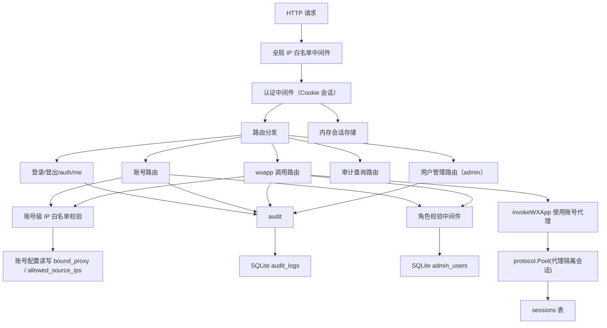

# 账号安全加固与账号级 IP 绑定

Feature Name: account-security-hardening
Updated: 2026-08-01

## Description

为 YYB Go 微信账号管理服务补齐安全加固能力与账号级 IP 绑定：

1. **管理后台登录鉴权**：启动参数 `--admin-password` 初始化管理员，服务端会话 Cookie 机制，连续失败锁定
2. **全量操作审计日志**：独立 `audit_logs` 只追加表，覆盖全部敏感操作
3. **分级权限**：管理员 / 操作员 / 只读用户三级角色，服务端中间件强制校验
4. **全局来源 IP 白名单**：可选启用，支持单 IP 与 CIDR
5. **账号级出口代理（bound_proxy）**：每账号独立出口 IP，会话按 `(account, tcp_proxy)` 天然隔离
6. **账号级来源 IP 白名单（allowed_source_ips）**：对账号级请求做来源 IP 校验

底层条件已完备：`sessions` 表唯一键 `(wechat_account_id, tcp_proxy)`、`transport.go` 原生支持 SOCKS5 / HTTP CONNECT、`effectiveProxy` 已有回退逻辑。

## Architecture



架构要点：安全能力以 gin 中间件链叠加，不侵入既有业务处理逻辑。认证会话存内存（单实例、重启即失效、滑动续期），审计日志持久化到 SQLite。

## Components and Interfaces

### 1. 认证与会话（internal/auth）

新增 `internal/auth` 包：

- `Manager`：会话管理，`map[sessionID]*Session` + 互斥锁，支持 `Create / Get / Delete / Renew`
- `Session`：`{ ID, UserID, Username, Role, ExpiresAt, SourceIP }`
- `PasswordHasher`：bcrypt 封装（`Hash / Verify`）
- 登录锁定：`admin_users.locked_until` + `failed_attempts`，连续失败 5 次锁定 30 分钟
- 会话 TTL：30 分钟（复用 `Config.SessionTTL`），每次请求滑动续期

中间件 `AuthMiddleware(manager, publicPaths)`：从 Cookie（`yyb_session`）读取会话 ID → 校验有效性 → 注入 `auth.CurrentUser` 上下文。

公开路径集合：`/health`、`/auth/login`、`/auth/logout`、`/qr`、`/qr/*`、`/scan`、`/static/*`、`/favicon.ico`。

### 2. 角色权限（internal/auth）

- 角色枚举：`admin`、`operator`、`viewer`
- 中间件 `RequireRole(roles...)`：从上下文取用户角色，不匹配返回 HTTP 403
- 路由权限矩阵：

| 路由组 | admin | operator | viewer |
|---|---|---|---|
| 账号查看（GET /accounts, avatar, config） | 允许 | 允许 | 允许 |
| 账号操作（DELETE、refresh、resync、config 更新、wxapp 调用） | 允许 | 允许 | 拒绝 |
| 用户管理（/auth/users*） | 允许 | 拒绝 | 拒绝 |
| 审计日志查询（/audit/logs） | 允许 | 拒绝 | 拒绝 |

### 3. 来源 IP 白名单（internal/ipfilter）

- `Matcher`：编译 IP/CIDR 列表（支持单 IP 与 CIDR），`Allow(ip net.IP) bool`
- `ClientIP(r *http.Request)`：优先取 `X-Forwarded-For` 首项、`X-Real-IP`，否则 `r.RemoteAddr`
- 全局白名单中间件：非空即启用，`/health` 放行，其余路由校验，不匹配返回 403
- 账号级白名单：账号解析成功后校验 `allowed_source_ips`，空则放行

### 4. 审计日志（internal/audit）

- `Store`：`Append(ctx, Entry)` 与 `Query(ctx, filter, limit, offset)` 
- `Entry`：`{ TS, Operator, Action, TargetType, TargetID, Result, Detail, SourceIP }`
- 动作枚举：`login_success`、`login_fail`、`logout`、`account_create`、`account_delete`、`account_refresh`、`account_resync`、`account_config_update`、`wxapp_call`、`user_create`、`user_delete`、`user_role_update`、`password_change`、`session_invalid`
- 只追加：API 层不提供删除/修改接口，表结构无 UPDATE 路径

### 5. 数据访问层扩展（internal/store）

`wechat_accounts` 迁移新增两列（SQLite `ALTER TABLE ADD COLUMN`，用 `PRAGMA table_info` 判断存在性）：

```
bound_proxy TEXT
allowed_source_ips TEXT
```

新增表：

```
CREATE TABLE IF NOT EXISTS admin_users (
    id               INTEGER PRIMARY KEY AUTOINCREMENT,
    username         TEXT    NOT NULL UNIQUE,
    password_hash    TEXT    NOT NULL,
    role             TEXT    NOT NULL DEFAULT 'admin',
    locked_until     INTEGER NOT NULL DEFAULT 0,
    failed_attempts  INTEGER NOT NULL DEFAULT 0,
    last_login_at    INTEGER,
    created_at       INTEGER NOT NULL,
    updated_at       INTEGER NOT NULL
);

CREATE TABLE IF NOT EXISTS audit_logs (
    id          INTEGER PRIMARY KEY AUTOINCREMENT,
    ts          INTEGER NOT NULL,
    operator    TEXT    NOT NULL,
    action      TEXT    NOT NULL,
    target_type TEXT,
    target_id   TEXT,
    result      TEXT    NOT NULL,
    detail      TEXT,
    source_ip   TEXT
);
CREATE INDEX IF NOT EXISTS idx_audit_ts ON audit_logs(ts);
CREATE INDEX IF NOT EXISTS idx_audit_action ON audit_logs(action);
```

`WechatAccount` 结构体新增 `BoundProxy`、`AllowedSourceIPs` 字段；`selectAccountSQL` 与 `scanAccountRows` 同步扩展。

新增 store 方法：

- `GetUser / GetUserByName / CreateUser / DeleteUser / SetUserRole / SetUserPassword / UpdateUserLoginMeta`
- `AppendAudit / QueryAudit`
- `GetAccountConfig / SetAccountConfig`（更新 bound_proxy 与 allowed_source_ips）
- `SetAccountProxy`（单独更新 bound_proxy）

### 6. 账号代理接入调用链（internal/httpapi）

- `effectiveAccountProxy(acc)`：`acc.BoundProxy` 非空用账号代理，否则回退全局 `a.cfg.TCPProxy`
- `invokeWXApp`：将 `a.cfg.TCPProxy` 替换为 `effectiveAccountProxy(acc)`，会话按代理隔离自动成立
- `invokeGetCode / invokeGetPhoneNumber / invokeOperateWXData`：同样传入账号代理
- 会话失效处理：`Invalidate` 使用账号代理值，保证与写入键一致
- 更新 `bound_proxy` 时调用 `InvalidateSession(acc.ID, oldProxy)` 清理旧会话

### 7. HTTP 路由与前端

新增路由：

```
POST   /auth/login
POST   /auth/logout
GET    /auth/me
GET    /auth/users               (admin)
POST   /auth/users               (admin)
DELETE /auth/users/:id           (admin)
POST   /auth/users/:id/role      (admin)
POST   /auth/password
GET    /audit/logs               (admin)
GET    /accounts/:ref/config
POST   /accounts/:ref/config     (operator/admin)
```

前端 `index.html`：

- 未登录（401）时展示登录表单，登录成功刷新控制台
- 顶栏新增当前用户信息与退出登录
- 账号详情面板新增「绑定代理」与「来源 IP 白名单」输入框，提交调用 `/accounts/:ref/config`
- 管理面板（admin）：用户列表与角色管理、审计日志查询表格

### 8. 启动配置

`main.go` 新增 flag：

- `--admin-password`：初始化管理员密码；已存在用户时忽略
- `--allowed-ips`：全局白名单，逗号分隔（单 IP 或 CIDR），为空表示不启用

## Data Models

### wechat_accounts 变更

| 列 | 类型 | 说明 |
|---|---|---|
| bound_proxy | TEXT | 账号专属出口代理，`socks5://host:port` 或 `http-connect://host:port` |
| allowed_source_ips | TEXT | 来源 IP 白名单，JSON 数组或逗号分隔，支持 CIDR |

### admin_users

| 列 | 类型 | 说明 |
|---|---|---|
| id | INTEGER PK | 用户 ID |
| username | TEXT UNIQUE | 登录名 |
| password_hash | TEXT | bcrypt 哈希 |
| role | TEXT | admin / operator / viewer |
| locked_until | INTEGER | 锁定截止时间戳，0 表示未锁定 |
| failed_attempts | INTEGER | 连续失败次数 |
| last_login_at | INTEGER | 最近登录时间 |
| created_at / updated_at | INTEGER | 时间戳 |

### audit_logs

| 列 | 类型 | 说明 |
|---|---|---|
| id | INTEGER PK | 自增 ID |
| ts | INTEGER | 事件时间戳 |
| operator | TEXT | 操作者用户名，未认证事件记为 `anonymous` |
| action | TEXT | 动作枚举 |
| target_type / target_id | TEXT | 目标对象与标识 |
| result | TEXT | success / fail |
| detail | TEXT | 请求详情摘要（敏感字段脱敏） |
| source_ip | TEXT | 来源 IP |

## Correctness Properties

- 会话 ID 由 `crypto/rand` 生成 32 字节随机值，服务端仅存哈希，DB 泄露不影响已发会话
- 密码始终以 bcrypt 哈希存储，任何日志与响应不出现明文
- 登录失败 5 次锁定 30 分钟；锁定期间即使密码正确也拒绝，避免锁定绕过
- 角色校验与 IP 白名单在服务端强制执行，前端隐藏仅作 UX
- 账号代理为空时回退全局代理，全局代理为空时直连，与现有 `effectiveProxy` 语义一致
- 更新 `bound_proxy` 后旧代理会话立即失效，防止新代理配置生效前误用旧会话
- 审计日志只追加：无修改/删除 API，表结构无更新路径
- 全局白名单启用时仅 `GET /health` 放行，其余所有路由（含登录、静态资源）均校验，防止绕过
- 账号级白名单空值语义为「放行全部来源」，与需求一致

## Error Handling

| 场景 | 响应 |
|---|---|
| 会话无效或缺失 | `401 {"code":401,"msg":"unauthorized"}` |
| 角色不足 | `403 {"code":403,"msg":"forbidden"}` |
| 全局白名单不匹配 | `403 {"code":403,"msg":"ip not allowed"}` |
| 账号级白名单不匹配 | `403 {"code":403,"msg":"source ip not allowed for account"}` |
| 登录锁定 | `423 {"code":423,"msg":"account locked, retry in N minutes"}` |
| 用户名或密码错误 | `401 {"code":401,"msg":"invalid credentials"}` |
| bound_proxy 格式非法 | `400 {"code":400,"msg":"invalid proxy"}`，复用 `parseTCPProxy` 校验 |
| allowed_source_ips 格式非法 | `400 {"code":400,"msg":"invalid ip list"}` |
| 审计日志写入失败 | 返回操作本身失败（审计失败不静默），保证操作与审计一致 |

## Test Strategy

- **store_test**：账号配置字段读写、admin_users CRUD、audit 追加与查询、迁移幂等性（老库加列、新库建表）
- **auth_test**：登录成功/失败/连续失败锁定/锁定过期解锁、会话创建校验删除续期、bcrypt 哈希校验
- **ipfilter_test**：单 IP / CIDR / 端口剥离 / XFF 头解析 / 空列表放行
- **httpapi_test**（gin httptest）：未认证 401、viewer 变更操作 403、operator 用户管理 403、账号级白名单命中/未命中、登录→Cookie→访问受保护路由全链路
- **proxy 集成**：bound_proxy 非空时 `invokeWXApp` 传入账号代理，空时回退全局（单测断言参数传递）

## References

[^1]: (internal/httpapi/app.go#L601) - invokeWXApp 代理参数传递点
[^2]: (internal/httpapi/app.go#L107) - Handler 路由注册，中间件叠加位置
[^3]: (internal/store/store.go#L35) - sessions 表 (wechat_account_id, tcp_proxy) 唯一键
[^4]: (internal/protocol/transport.go#L22) - parseTCPProxy 代理格式校验
[^5]: (internal/protocol/pool.go#L143) - run 中 effectiveProxy 回退逻辑
